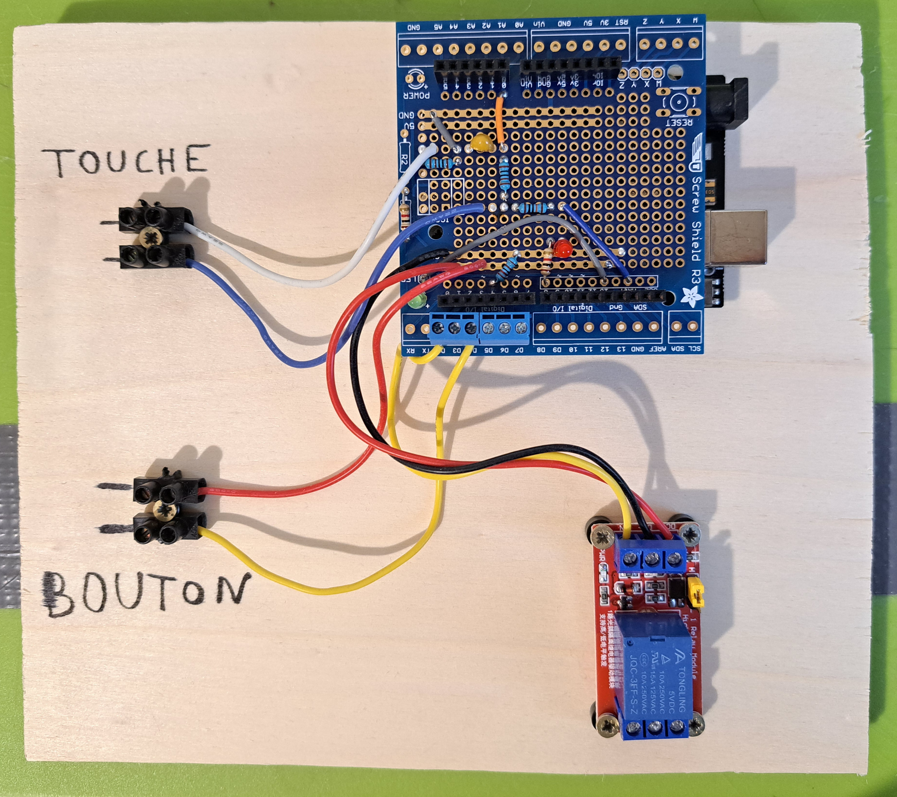

# Human circuit

The aim of the project is to detect when a human touch two metal bars connected to a circuit.

## How it works

When a player hold the two bars, the corresponding analog input decrease below a threshold and then a timer is incremented.

1. Use case "electrical chair" :

If the human touch > 60s then deactivate an EM. If not touch during the 60s, then start again. During touching, activate a taser (during 3s) every 15s.

2. Use case "human chain" :

If the human chain touch > 5s then deactivate an EM. If not touch during the 5s, then start again.

There is also a button for the game master to open the electromagnet manually.

## Hardware

The system consists of an arduino uno, a [prototype screw shield](https://www.amazon.fr/dp/B01BMRETAQ?ref_=cm_sw_r_apan_dp_F4M61250RK2558SYEJES), 1 or 2 [optos](https://www.amazon.fr/Electrely-Module-Optocoupleur-Compatible-D%C3%A9clencheur/dp/B07GRW83FR/ref=sr_1_8?keywords=Arduino+5v+Relay+Module&qid=1677014023&sr=8-8) and some electrical components such as resistors, capacitors and terminals:

Note: the "taser relay" is only present for the "electrical chair" use case.

## Illustrations

Here is the "electrical chair" prototype:

Here is the "human chain" prototype:

