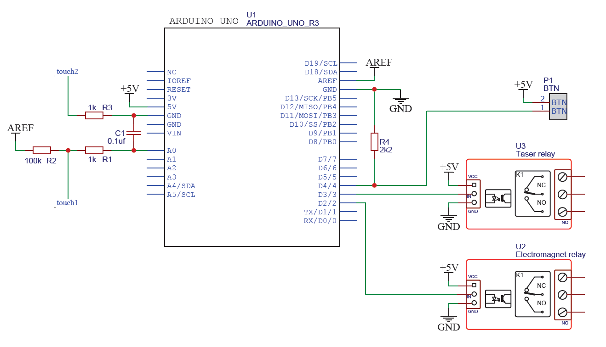

# Human circuit

The aim of the project is to detect when a human touch two metal bars connected to a circuit.

## How it works

When a player hold the two bars, the corresponding analog input decrease below a threshold and then a timer is incremented.
During this time, every 20 seconds a relay drives an output active for 4 seconds.
If the player holds the bars for more than 90 seconds then it is won and a relay is driven to open an electromagnet.

There is also a button for the game master to open the electromagnet manually.

## Hardware

The system consists of an arduino uno, a [prototype screw shield](https://www.amazon.fr/dp/B01BMRETAQ?ref_=cm_sw_r_apan_dp_F4M61250RK2558SYEJES), 2 [optos](https://www.amazon.fr/Electrely-Module-Optocoupleur-Compatible-D%C3%A9clencheur/dp/B07GRW83FR/ref=sr_1_8?keywords=Arduino+5v+Relay+Module&qid=1677014023&sr=8-8) and some electrical components such as resistors, capacitors and terminals:

## Illustrations

Here is the prototype:

